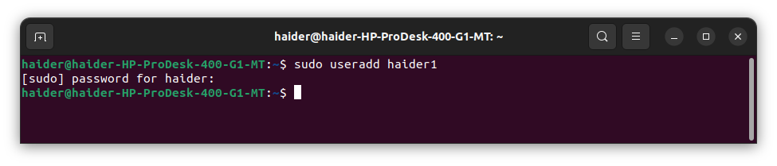
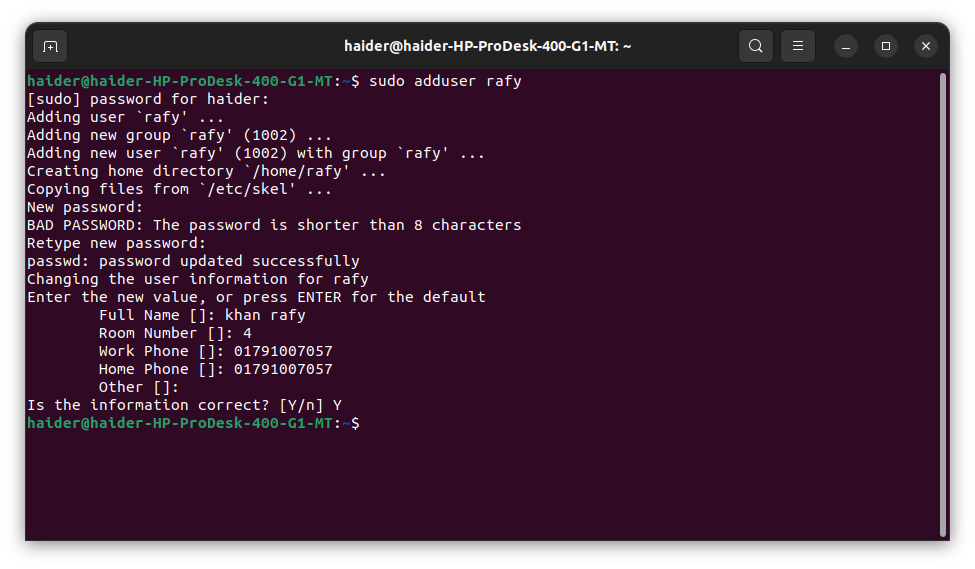
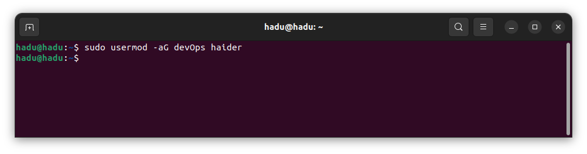
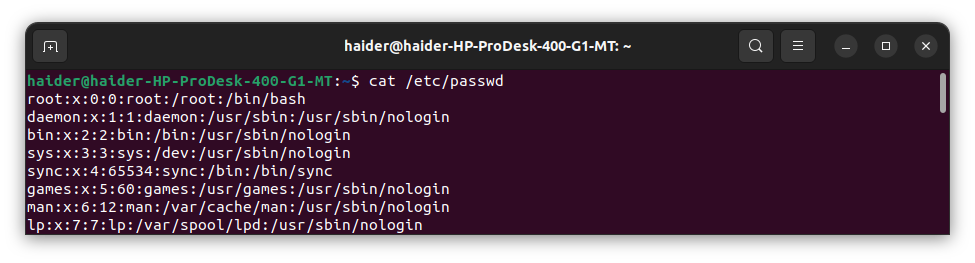
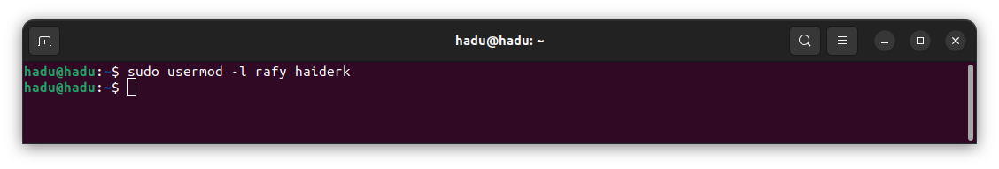
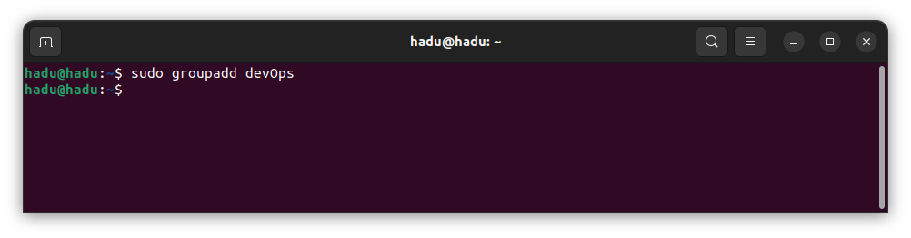
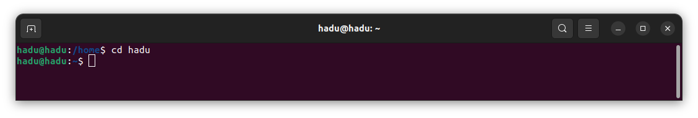
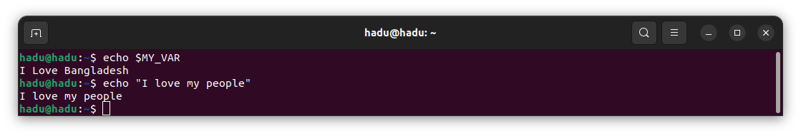
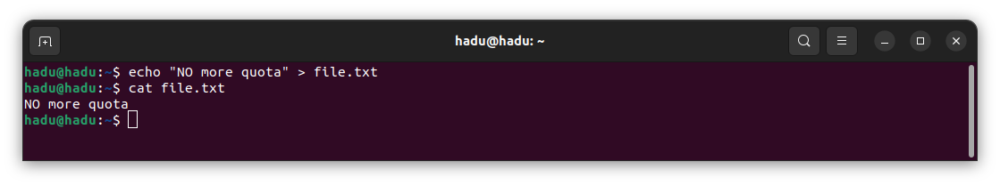
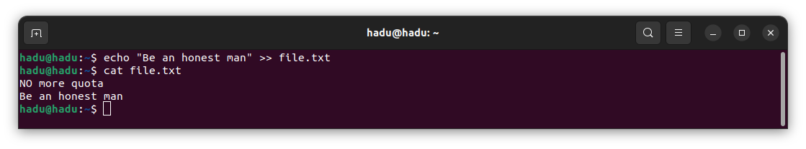

# বাংলায় লিনাক্স

1. **[ভূমিকা](#ভূমিকা)**
   - লিনাক্স কি ?
   - লিনাক্সের ইতিহাস
   - লিনাক্স এবং অন্যান্য সিস্টেমের মধ্যে পার্থক্য (e.g., Windows, macOS)
   - সুবিধা সমূহ (security, stability, customization, open-source)
   - প্রধান ব্যবহার সমূহ
   - লিনাক্স ডিস্ট্রিবিউশন

2. **[ইন্সটলেশন ও সেটআপ](#ইন্সটলেশন-ও-সেটআপ)**

   - Ubuntu ইনস্টলের ধাপ
   - ডুয়েল বুট করা
   - সেটআপ
   - ইউজার একাউন্ট সেটআপ করা
   - বেসিক কনফিগারেশন (language, time zone, network)

3. **[লিনাক্স ফাইল সিস্টেম](#লিনাক্স-ফাইল-সিস্টেম)**
   - ফাইল সিস্টেম হায়ারার্কি
   - গুরুত্বপূর্ণ ডিরেক্টরি সমূহ (/, /home, /etc, /var, /usr, /tmp)

4. **[ইউজার এবং গ্রুপ ম্যানেজমেন্ট](#ইউজার-এবং-গ্রুপ-ম্যানেজমেন্ট)**

   - ইউজার
   - ইউজার ম্যানেজমেন্ট
     - নতুন ইউজার যুক্ত করা, ডিলিট করা, এবং মডিফাই করা (`cat /etc/passwd`, `useradd`, `usermod`, `userdel`, `adduser`, `passwd`, `who`, `whoami`)
   - গ্রুপ
   - গ্রুপ ম্যানেজমেন্ট
     - নতুন ইউজার যুক্ত করা, ডিলিট করা, এবং মডিফাই করা (`cat /etc/group`,`groupadd`, `groupmod`, `groupdel`, `groups`)
  
5. **[বেসিক লিনাক্স কমান্ড](#বেসিক-লিনাক্স-কমান্ড)**

   - ডিরেক্টরিতে বিভিন্ন অপারেশন
     - `ls`, `cd`, `pwd`, `mkdir`, `rmdir`
   - ফাইলে বিভিন্ন অপারেশন
     - `cp`, `mv`, `rm`, `touch`, `echo`, `cat`, `nano`,`vim`, `more`, `less`, `head`, `tail`
   - টেক্সট প্রসেসিং কমান্ড
     - `uniq`, `cut`, `diff`, `grep`, `awk`, `find`, `sed`, `|`
   - সফ্টলিংক ও হার্ডলিংক
   - ফাইল, ডিরেক্টরি পারমিশন এবং ওনারশিপ
     - `chmod`, `chown`
  
6. **[সিস্টেম এবং প্রসেস](#সিস্টেম-এবং-প্রসেস)**

   - প্রসেস ম্যানেজ করা
     - `ps`, `top`, `kill`, `pkill`, `pstree`
   - সিস্টেম ইনফরমেশন দেখা
      - `uname`, `df`, `du`, `free`
   - প্যাকেজ/সফটওয়্যার ইনস্টল এবং রিমুভ করা
     - `apt`, `yum`, `dnf`, `dpkg`
   - systemctl
   - corntab

7. **[নেটওয়ার্কিং](#নেটওয়ার্কিং)**
   - নেটওয়ার্ক স্টেটাস
     - `ifconfig`, `ip`
   - নেটওয়ার্ক কানেকশন ম্যানেজ করা
   - বেসিক নেটওয়ার্কিং কমান্ড
     - `ping`, `netstat`, `ssh`, `scp`

8. **[সিস্টেম মনিটর এবং মেইনটেইন করা](#সিস্টেম-মনিটর-এবং-মেইনটেইন-করা)**

   - সিস্টেম মনিটর করা (`top`, `htop`, `iotop`)
   - সিস্টেম আপডেট ও আপগ্রেড করা(`apt update`,` apt upgrade`)

9. **[বেসিক সিকিউরিটি প্র্যাক্টিস](#বেসিক-সিকিউরিটি-প্র্যাক্টিস)**

   - বিভিন্ন ইউজারের ক্ষমতা (`root` এবং `sudo`)
   - ফায়ারওয়াল সেট করা(`ufw`)
   - রেগুলার আপডেট করা
   - শক্তিশালী পাসওয়ার্ড ব্যবহার করা
  
10.  **[গুরুত্বপূর্ণ কনসেপ্ট সমূহ](#গুরুত্বপূর্ণ-কনসেপ্ট-সমূহ)**
    - এনভায়রনমেন্ট ভেরিয়েবল
  
11.  **[ট্রাবলশ্যুটিং](#ট্রাবলশ্যুটিং)**
    - বুট সমস্যা
    - নেটওয়ার্ক সমস্যা
    - ফাইল পারমিশনে সমস্যা 
    - লগ ফাইলস এক্সেস করা (`/var/log`)

12. **[রেফারেন্স এবং বই](#রেফারেন্স-এবং-বই)**
    - অফিসিয়াল উবুন্টু ডকুমেন্টেশন
    - অনলাইন টিউটোরিয়াল
    - বই ও রেফারেন্স


# ভূমিকা
### লিনাক্স কি ?
একটি ওপেন সোর্স অপারেটিং সিস্টেম। যা সবার জন্য একদম ফ্রী।

### লিনাক্সের ইতিহাস
- [লিনাস টোরভাল্ডস](https://en.wikipedia.org/wiki/Linus_Torvalds) ১৯৯১ সালে লিনাক্স অপারেটিং সিস্টেম আবিষ্কার করেন।

### লিনাক্স এবং অন্যান্য সিস্টেমের মধ্যে পার্থক্য (e.g., Windows, macOS)
- লিনাক্স হলো [ওপেন সোর্স](https://opensource.com/resources/what-open-source), যেখানে Windows এবং macOS প্রোপাইটারি সিস্টেম।অর্থাৎ, লিনাক্স আপনি সম্পূর্ণ ফ্রি, কিন্তু Windows ও MacOS ডলার খরচ করে কিনতে হয়। যদিও আমরা windows এর পাইরেসি ভার্সন তৃতীয় বিশ্বের দেশ গুলো তে ব্যবহার করতে পারি।
আবার, লিনাক্স অনেক বেশি কাস্টমাইজেবল এবং নিরাপদ।

### সুবিধা সমূহ (security, stability, customization, open-source)
  
লিনাক্সের প্রধান ৪ টা সুবিধা হলো, 
১. এটা সম্পূর্ণ ফ্রী এবং ওপেন সোর্স। 
২. প্রয়োজন মতো যত ইচ্ছা কাস্টমাইজ করা যায়।
৩. লিনাক্স খুবই স্টেবল একটা অপারেটিং সিস্টেম। এটা অন্য অপারেটিং সিস্টেমের মতো ঘন ঘন আপডেট করা লাগেনা। 
৪. লিনাক্স অত্যন্ত নিরাপদ।  যার কারণে প্রোডাক্শনে এটি ব্যবহার করা হয়।

এছাড়া আরও বেশ কিছু সুবিধা রয়েছে।

### প্রধান ব্যবহার সমূহ
- সার্ভার, ডেভেলপমেন্ট, সিকিউরিটি রিসার্চ, পার্সোনাল কম্পিউটিং ইত্যাদি।

### লিনাক্স ডিস্ট্রিবিউশন
লিনাক্স অপারেটিং সিস্টেমকে বিভিন্ন প্রয়োজন মেটাতে অনেক কোম্পানি তাদের নিজস্বভাবে কাস্টমাইজ করে এবং অনেক সময় সেগুলোকে ওপেন সোর্স হিসাবে প্রকাশ করে। এভাবেই তৈরি হয় বিভিন্ন লিনাক্স ডিস্ট্রিবিউশন। কিছু জনপ্রিয় লিনাক্স ডিস্ট্রিবিউশন হলো:

Fedora: নিয়মিত আপডেট এবং নতুন লিনাক্স প্রযুক্তি নিয়ে আসা একটি জনপ্রিয় ডিস্ট্রিবিউশন। ডেভেলপার ও উৎসাহী ব্যবহারকারীদের জন্য উপযুক্ত।

Ubuntu: ব্যক্তিগত ব্যবহারকারীদের জন্য জনপ্রিয় একটি ডিস্ট্রিবিউশন যার ডেস্কটপ পরিবেশ ব্যবহার করা সহজ।

Debian: বহুমুখী ও স্থিতিশীল একটি ডিস্ট্রিবিউশন, ব্যাপক সফটওয়্যার ভান্ডার এবং বিভিন্ন ধরনের হার্ডওয়্যার সমর্থন করে। বিভিন্ন কাজের জন্য উপযোগী।

Arch Linux: হালকা ও সহজ, আধুনিক এবং বহুমুখী একটি ডিস্ট্রিবিউশন যাতে সর্বশেষ প্রযুক্তি ব্যবহার করা হয়।

Linux Mint: Ubuntu ও Debian-এর উপর ভিত্তি করে তৈরি একটি ওপেন সোর্স ডিস্ট্রিবিউশন যা স্থিতিশীল এবং নতুন ও অভিজ্ঞ ব্যবহারকারীদের জন্য ব্যবহার করা সহজ।

elementary OS: সরল ও শেখা সহজ একটি ডিস্ট্রিবিউশন যা ব্যবহারকারীদের গুরুত্বপূর্ণ বিষয়গুলোতে মনোযোগ দিতে এবং উৎপাদনশীলতা বাড়াতে সাহায্য করে।

Zorin OS: Ubuntu-এর উপর ভিত্তি করে তৈরি একটি ডিস্ট্রিবিউশন যা Windows ও macOS-এর নিরাপদ বিকল্প হিসাবে ডিজাইন করা হয়েছে এবং Appearance অ্যাপের সাহায্যে ডেস্কটপের সাজানো সহজ।

MX Linux: ব্যবহারকারী বান্ধব ও স্থিতিশীল একটি ডিস্ট্রিবিউশন যা Debian-এর উপর ভিত্তি করে তৈরি এবং তিনটি ডেস্কটপ পরিবেশ ও অনেক প্রাক-ইনস্টল অ্যাপ্লিকেশন নিয়ে আসে।

# ইন্সটলেশন ও সেটআপ

### Ubuntu ইনস্টলের ধাপ

ধাপ ১:  ISO ইমেজ ডাউনলোড করুন
পছন্দের লিনাক্স ডিস্ট্রো (যেমন [Ubuntu](https://ubuntu.com/download/desktop)) এর অফিসিয়াল ওয়েবসাইট থেকে ISO ইমেজ ডাউনলোড করুন।

ধাপ ২: বুটেবল USB ড্রাইভ তৈরি করুন
একটি USB ড্রাইভ সংযুক্ত করুন (সর্বনিম্ন 6 জিবি বা তার বেশি স্টোরেজ সাইজ হতে হবে )।
- প্রথমে একটা windows কম্পিউটারে [Rufus](https://rufus.ie/en/) সফটওয়্যারটি ডাউনলোড এবং ইন্সটল করুন।
- Rufus চালু করুন এবং ডাউনলোড করা ISO ফাইলটি ব্রাউস অপসন থেকে সিলেক্ট করুন।
- ড্রাইভ নির্বাচন করে “Start”  বাটনে ক্লিক করুন।

ধাপ ৩: বুট মেনুতে প্রবেশ করুন

এবার USB পেনড্রাইভটি যে কম্পিউটারে Ubuntu ইনস্টল করতে চান সেটির পোর্টে লাগিয়ে দিন। এরপর আপনার কম্পিউটারটি রিস্টার্ট করুন এবং BIOS/UEFI সেটআপে প্রবেশ করার জন্য প্রয়োজনীয় কী (সাধারণত F2, F12, Del বা Esc) চাপতে থাকুন।

বুট অপশন থেকে ইউএসবি ড্রাইভ নির্বাচন করুন।
এবার Ubuntu ইনস্টল হওয়া শুরু হবে।

# লিনাক্স ফাইল সিস্টেম

লিনাক্স ফাইল সিস্টেম হলো ডেটা স্টোরেজ ও অর্গানাইজেশনের জন্য একটি কাঠামো মধ্যে অনেক ডিরেক্টরি ও ফাইল হায়ারার্কিক্যাল অর্ডারে সাজানো থাকে।

ফাইল সিস্টেম হায়ারার্কি:
লিনাক্স ফাইল সিস্টেম একটি হায়ারার্কিক্যাল কাঠামো অনুসরণ করে, যেখানে '/' (রুট) ডিরেক্টরি সর্বোচ্চ স্তরে থাকে। এর মধ্যে, বিভিন্ন ডিরেক্টরি শাখা-প্রশাখা হয়ে বিভিন্ন কাজ করে।

কিছু গুরুত্বপূর্ণ ডিরেক্টরি ও তাদের কাজ:

/ (রুট): সমগ্র ফাইল সিস্টেমের মূল ডিরেক্টরি।
/home: ব্যবহারকারীদের ডেটা সংরক্ষণের জন্য।
/etc: সিস্টেম কনফিগারেশন ফাইল ধারণ করে।
/var: ভেরিয়েবল ডেটা সংরক্ষণের জন্য।
/usr: ব্যবহারকারীদের ইনস্টল করা অ্যাপ্লিকেশন ধারণ করে।
/tmp: অস্থায়ী ফাইল সংরক্ষণের জন্য।

দ্রষ্টব্য: লিনাক্স ডিস্ট্রিবিউশনের উপর নির্ভর করে ডিরেক্টরি নামকরণ ও কাঠামোতে ভিন্নতা থাকতে পারে।

# ইউজার এবং গ্রুপ ম্যানেজমেন্ট

লিনাক্স অপারেটিং সিস্টেমে খুব সহজেই নতুন ইউজার ও গ্রুপ তৈরী করা যায়। একটি প্রজেক্টে ইউজার ও গ্রুপের অনেক রকম ব্যবহার থাকে।

### ইউজার

লিনাক্স সার্ভারে এক্সেস করতে হলে তার একটা ইউজার একাউন্ট থাকতে হয়। যেমন : আপনার ফেসবুক একাউন্ট আছে সেরকম। একজন ডেভেলপার তার ইউজার নেম ও পাসওয়ার্ড ব্যবহার করে লগইন করে। এখন আমরা ইউজার রিলেটেড কিছু গুরুত্বপূর্ণ কন্সেপ্ট ও কমান্ড শিখবো।

### নতুন ইউজার তৈরী করা
নতুন ইউজার তৈরি ও পাসওয়ার্ড সেট করতে `useradd` ও `passed` ব্যবহার করতে হয়। কিন্তু , `adduser` কমান্ড ব্যবহার করে একেবারেই করা যায়।

#### `useradd <username>`
নতুন ইউজার তৈরি করার জন্য।

  ```bash
  sudo useradd haider
  ```
  

#### `passwd <username>`
ইউজারের পাসওয়ার্ড সেট বা পরিবর্তন করার জন্য।
  ```bash
  sudo passwd haider
  ```
  

#### `adduser <username>`
নতুন ইউজার তৈরি করার ইন্টারেক্টিভ কমান্ড,

  ```bash
  sudo adduser rafy
  ```
  


### ইউজারকে গ্রুপে যুক্ত করা:

যখন একটা ইউজার তৈরী করা হয় তখন ওই নামে একটা গ্রুপও অটোমেটিক তৈরী হয়ে যায়, এবং ইউজার সেই গ্রুপের ওনার হিসেবে থাকে। বিভিন্ন প্রয়োজনে ইউজারকে অন্য গ্রুপে যুক্ত করতে হয়।

#### `usermod -aG <group> <username>`
ইউজারকে নতুন গ্রুপে যুক্ত করতে,

  ```bash
  usermod -aG sudo haider
  ```
  

### ইউজার রিলেটেড আরও কমান্ড

#### `su - username`
একটা ইউজার থেকে আরেক ইউজারে সুইচ করতে,

  ```bash
  su - username
  ```
  

#### `cat /etc/passwd`
সিস্টেমে যতগুলো ইউজার আছে তা দেখতে,

```bash
cat /etc/passwd
```


#### `usermod -l <newusername> <oldusername>` 
ইউজারের নাম পরিবর্তন করার জন্য,
  ```bash
  usermod -l rafy haider
  ```


#### `userdel <username>`
ইউজার ডিলিট করার জন্য।
  ```bash
  sudo userdel haider
  ```
  

#### `passwd <username>`
ইউজারের পাসওয়ার্ড সেট বা পরিবর্তন করার জন্য।
  ```bash
  sudo passwd haider
  ```
  
#### `who`
সিস্টেমে লগইন করা ইউজারদের তালিকা দেখার জন্য।
  
  ```bash
  who
  ```
  

#### `whoami`
বর্তমানে কোন ইউজার লগইন আছে সেটা দেখতে।

  ```bash
  whoami
  ```
  

### গ্রুপ

একটি গ্রুপের সাথে প্রজেক্টের ফাইল ,ডিরেক্টরি কে যুক্ত করে , তারপর গ্রুপের পারমিশন যা যা সেট করা হবে তা একটি গ্রুপের সব ইউজারের উপর এপলাই হবে। ফলে ১০ জন ডেভেলপারকে আলাদা আলাদা করে পারমিশন সেট করে দিতে হবেনা। এক বারেই কাজ হয়ে যাবে।

### নতুন গ্রুপ যুক্ত করা

#### `groupadd <groupname>`
নতুন গ্রুপ তৈরি করার জন্য।
  
  ```bash
  sudo groupadd devOps
  ```
  

### গ্রুপ মডিফাই করা:

#### `groupmod -n <newgroupname> <oldgroupname>`

গ্রুপের নাম পরিবর্তন করার জন্য।
  
  ```bash
  sudo groupmod -n newdevs devOps
  ```
  

#### `groupdel <groupname>`
গ্রুপ ডিলিট করার জন্য।

  ```bash
  sudo groupdel devOps
  ```
  

#### `cat /etc/group`

সিস্টেমে যত গুলো গ্রুপ আছে তার লিস্ট দেখতে।


#### `groups <username>`

একটি ইউজার কোন কোন গ্রুপের মেম্বার তা দেখতে।


# বেসিক লিনাক্স কমান্ড

ডিরেক্টরি , ফাইল , টেক্সট , হার্ড লিংক ও সফ্ট লিংক এবং পারমিশন সম্পর্কিত গুরুত্বপূর্ণ কমান্ড গুলি দেখবো।

### ডিরেক্টরিতে বিভিন্ন অপারেশন


#### `ls`
বর্তমান ডিরেক্টরির ফাইল এবং ফোল্ডারগুলির তালিকা দেখার জন্য।

  ```bash
  ls -l
  ```
  

#### `cd <directory>`
নির্দিষ্ট ডিরেক্টরিতে যাওয়ার জন্য,

  ```bash
  cd /home/hadu
  ```


#### `pwd`

বর্তমান ডিরেক্টরির পূর্ণ পথ দেখানোর জন্য।

  ```bash
  pwd
  ```
  

#### `mkdir <directory>`

নতুন ডিরেক্টরি তৈরি করার জন্য।

  ```bash
  mkdir newfolder
  ```
  

#### `rmdir <directory>`

খালি ডিরেক্টরি ডিলিট করার জন্য।

  ```bash
  rmdir newfolder
  ```
  

ফাইল সহ কোনো ডিরেক্টরি ডিলিট করতে।
  ```bash
  rm -rf dirname
  ```
  

### ফাইলে বিভিন্ন অপারেশন

#### `touch <file>`
একটি নতুন খালি ফাইল তৈরি করার জন্য।

  ```bash
  touch newfile.txt
  ```
  

#### `echo $VARIABLE/ "string"`

কোনো ভ্যারিয়েবল প্রিন্ট করতে,
```bash
echo $VARIABLE
```
আবার টেক্সট  প্রিন্ট করতে,
```bash
echo "string"
```


#### `echo "string"> file.txt`

ফাইলে সব কিছু রিমুভ করে নতুন টেক্সট লিখতে,
```bash
echo "string" > file.txt
```


#### `echo "string">> file.txt`

ফাইলে সব কিছু আগের মতোই রেখে, শেষে নতুন লাইন যুক্ত করতে,
```bash
echo "string" >> file.txt
```


#### `cat <file>`
কোনো ফাইল রিড করতে,

  ```bash
  cat file.txt
  ```
  

#### `cp <source> <destination>`
একটি ফাইল কপি করার জন্য।

  ```bash
  cp file1.txt file2.txt
  ```
  

#### `mv <source> <destination>`
একটি ফাইল স্থানান্তর বা নাম পরিবর্তন করার জন্য।

  ```bash
  mv oldname.txt newname.txt
  ```
  

#### `rm <file>`

একটি ফাইল ডিলিট করার জন্য।

  ```bash
  rm file.txt
  ```
  

#### `nano <file>`, `vim <file>`

Nano টেক্সট এডিটরে ফাইল এডিট জন্য।
  
  ```bash
  nano file.txt
  ```
  

এবার ফাইলে লিখার পর, সেভ এবং এক্সিট করতে "ctrl X " কী চাপতে হবে। আরো কিছু কমান্ড টেক্সট এডিটরের নিচের অংশে দেয়া আছে।

  


আরো বেশি পাওয়ারফুল টেক্সট এডিটর। আর এটি সব লিনাক্স সিস্টেমেই থাকে। কিন্তু Nano এডিটর আলাদা করে ইনস্টল করতে হয়। তবে অনেকে Vim ব্যবহার করতে ঝামেলা মনে করেন।

  ```bash
  vim file.txt
  ```
  

  ফাইল ওপেন হওয়ার পর প্রথমে `i` কী চাপতে হবে ফলে ইন্টারেক্টিভ মোডে যাবে এবং এবার এডিট করতে পারবেন।
  
  এডিট করা শেষ হলে এক্সিট + সেভ করতে প্রথমে 'esc ' প্রেস করতে হবে তারপর যথাক্রমে  `:` , `w` এবং `q` টাইপ করতে হবে।
+ 
  

#### `more <file>`, `less <file>`
লম্বা ফাইল দেখার জন্য।
  ```bash
  more file.txt
  ```

  ```bash
  less file.txt
  ```
  

#### `head <file>`
ফাইলের প্রথম কয়েক লাইন দেখার জন্য।
 
  ```bash
  head -n 10 file.txt
  ```
  

#### `tail <file>`
ফাইলের শেষ কয়েক লাইন দেখার জন্য।

  ```bash
  tail -n 10 file.txt
  ```
  

### টেক্সট প্রসেসিং কমান্ড

#### `uniq`
ফাইল থেকে ইউনিক লাইন দেখার জন্য।
  ```bash
  uniq firstFile.txt
  ```
  


#### `cut`
ফাইল থেকে নির্দিষ্ট কলাম কেটে দেখার জন্য।
  ```bash
  cut -d ',' -f 1 file.csv
  ```
  
    (কমা ডিলিমিটার ব্যবহার করে প্রথম কলামটি কেটে দেখাবে)

#### `diff`
দুটি ফাইলের মধ্যে পার্থক্য দেখার জন্য।

  ```bash
  diff file1.txt file2.txt
  ```
  

#### `grep`
ফাইলের মধ্যে নির্দিষ্ট টেক্সট খুঁজে বের করার জন্য।

  ```bash
  grep "search_text" file.txt
  ```
  

#### `awk`
ফাইলের নির্দিষ্ট অংশ প্রসেস করার জন্য। যেমনঃ এখানেপ্রতিটি লাইনের প্রথম কলাম প্রিন্ট করবে।

  ```bash
  awk '{print $1}' file.txt
  ```
  

#### `find`

নির্দিষ্ট ডিরেক্টরির মধ্যে ফাইল বা ডিরেক্টরি খুঁজে বের করার জন্য।

  ```bash
  find /path/to/search -name "*.txt"
  ```
  

#### `sed`
ফাইলে নির্দিষ্ট টেক্সট পরিবর্তন করার জন্য।

  ```bash
  sed 's/old_text/new_text/g' file.txt
  ```
  

#### `|`
একটি কমান্ডের আউটপুটকে অন্য কমান্ডে যুক্ত করে ব্যবহার করতে। যেমনঃ এখানে প্রথমে ফাইল `cat` করবে তারপর ফাইল থেকে কোনো টেক্সট grep করবে , sort এবং uniq ভাবে সাজাবে।
  
  ```bash
  cat file.txt | grep "search_text" | sort | uniq
  ```
  

### সফ্টলিংক ও হার্ডলিংক

#### সফ্ট লিংক (Soft Link)
  সফ্ট লিংক, বা সিম্বলিক লিংক, হলো একটি মেইন ফাইলের সাথে আরেকটি ফাইলের কানেকশন করা। যেকোনো ফাইলের চেঞ্জ অন্য সব ফাইলেই রিফ্লেক্ট হয়। লিংক ফাইল গুলো মূলত মেইন  ফাইলের পাথ মনে রাখে।তাই, মেইন ফাইল ডিলিট করা হলে পুরো সিস্টেমটাই নষ্ট হয়ে যায়।
  
#### `ln -s <target> <linkname>`
সফ্টলিংক (সিম্বলিক লিংক) তৈরি করার জন্য।
  
  ```bash
  ln -s file1.txt symlink.txt
  ```
  

#### হার্ড লিংক (Hard Link)

হার্ড লিংক একটি ফাইল সিস্টেমে মূল ফাইলের জন্য আরেকটি রেফারেন্স তৈরি করে। এটি মূল ফাইলের inode নম্বর ব্যবহার করে, তাই মূল ফাইল এবং হার্ড লিংক একই ডেটা পয়েন্ট করে।যেকোনো ফাইলের চেঞ্জ অন্য সব ফাইলেই রিফ্লেক্ট হয়। মূল ফাইল ডিলিট করা হলেও হার্ড লিংক কার্যকর থাকে এবং মূল ডেটা অ্যাক্সেসযোগ্য থাকে যতক্ষণ না সব লিংক ডিলিট করা হয়।

#### `ln <target> <linkname>`
হার্ডলিংক তৈরি করার জন্য।
  
  ```bash
  ln file1.txt hardlink.txt
  ```
  

### ফাইল, ডিরেক্টরি পারমিশন

লিনাক্স সিস্টেমে একটা ফাইল বা ডিরেক্টরি তে ইউজার(`u`) ,গ্রুপ (`g`) এবং অন্যরা কি ধরণের পারমিশন পাবে সেটা নির্ধারণ করে দেয়া যায়। পারমিশন সঠিক ভাবে ব্যবহার করা নিরাপত্তার জন্য খুবই গুরুত্বপূর্ণ। 

#### পারমিশন টাইপ:
এখানে ইংলিশ অক্ষর বা নম্বর ব্যবহার করা যায়। নাম্বারের ক্ষেত্রে যোগফল দিতে হয়।
  - **read (`r`/`4`)**: পড়ার পারমিশন
  - **write (`w`/`2`)**: লেখার পারমিশন
  - **execute (`x`/`1`)**: কোড রান করার পারমিশন

#### পারমিশন পরিবর্তন করা:

#### `chmod <permissions> <file>`

ফাইল বা ডিরেক্টরির পারমিশন পরিবর্তন করার জন্য। যেমন: আমি যদি ইউজার, গ্রুপ কে read, write,execute সব পারমিশন এবং আদার কে  দিতে চাই তাহলে এই কমান্ড ব্যবহার করতে হবে। 
  
  ```bash
  chmod u=rwx,g=rwx,o= file2.txt
  ```
  

Or,

  ```bash
  chmod 770 file2.txt
  ```

### ওনারশিপ পরিবর্তন করা:
  লিনাক্স ফাইল সিস্টেমে, মালিক (Owner) হল সেই ব্যবহারকারী যিনি একটি ফাইল বা ডিরেক্টরি তৈরি করেছেন বা যাকে নির্দিষ্টভাবে সেই ফাইল বা ডিরেক্টরির মালিক হিসেবে সেট করা হয়েছে। ওই ফাইলের উপর ওনার এর সর্বোচ্চ ক্ষমতা থাকে। চাইলেই যেকোনো ইউজারকে কোনো পারমিশন দিতে পারেন আবার তা নিয়ে নিতেও পারেন।

#### `chown <owner>:<group> <file>`
ফাইল বা ডিরেক্টরির ওনারশিপ পরিবর্তন করার জন্য।

  ```bash
  chown hadu:devOps file.txt
  ```
  

  এখানে file.csv কে hadu নামের ইউজার এবং devOps গ্রুপে ওনারশিপ দেয়া হয়েছে।

# সিস্টেম এবং প্রসেস

### প্রসেস ম্যানেজ করা


#### `ps`
বর্তমানে চলমান প্রসেসগুলির লিস্ট দেখার জন্য।
  
  ```bash
  ps aux
  ```

#### `top`
বর্তমানে চলমান প্রসেসগুলির রিয়েল-টাইম ভিউ দেখার জন্য।
  
  ```bash
  top
  ```
  

#### `kill`
নির্দিষ্ট প্রসেস আইডি (PID) দিয়ে প্রসেস কিল/স্টপ করার জন্য।
  
  ```bash
  kill 1234
  ```
  

#### `pkill`
প্রসেস নাম দিয়ে প্রসেস কিল/স্টপ করার জন্য।
  
  ```bash
  pkill firefox
  ```
  

#### `pstree`
প্রসেসগুলি ট্রি আকারে দেখার জন্য।
  
  ```bash
  pstree
  ```
  

### সিস্টেম ইনফরমেশন দেখা

#### `uname`
সিস্টেম ইনফরমেশন দেখার জন্য।
  
  ```bash
  uname -a
  ```


#### `df`
ডিস্ক ফাইল সিস্টেমের মেমরি স্পেস দেখার জন্য।
  
  ```bash
  df -h
  ```
  

#### `du`
ডিরেক্টরি এবং সাবডিরেক্টরির ব্যবহৃত স্পেস দেখার জন্য।
  
  ```bash
  du -sh /path/to/directory
  ```
  

#### `free`
মেমরি এবং সোয়াপ ব্যবহারের ইনফরমেশন দেখার জন্য।
  
  ```bash
  free -h
  ```
  

### প্যাকেজ/সফটওয়্যার ইনস্টল এবং রিমুভ করা

বিভিন্ন ধরণের প্যাকেজ ম্যানেজার আছে। তবে apt সবচেয়ে আপডেট ও সিকিউর।

#### `apt`
  
  ```bash
  sudo apt install package_name
  ```
  

  
  ```bash
  sudo apt remove package_name
  ```
  

#### `dpkg`
  
  ```bash
  sudo dpkg -i package_name.deb
  ```
  
  
  ```bash
  sudo dpkg -r package_name
  ```
  

#### রেড হ্যাট-ভিত্তিক সিস্টেম
সেন্টওএস, ফেডোরা তে কোনো কিছু ইনস্টল করতে এই প্যাকেজ ম্যানেজার গুলি ব্যবহার করা হয়।

#### `yum`  
  ```bash
  sudo yum install package_name
  ```
  
  ```bash
  sudo yum remove package_name
  ```

#### `dnf`
  
  ```bash
  sudo dnf install package_name
  ```

  ```bash
  sudo dnf remove package_name
  ```

### systemctl
systemctl একটি কমান্ড লাইন টুল যা systemd সিস্টেম এবং সার্ভিস ম্যানেজারের সাথে কাজ করার জন্য ব্যবহৃত হয়। এটি সার্ভিস `start`, `stop`, `restart`  এবং `status` দেখার জন্য ব্যবহার করা হয়। নিচে systemctl কমান্ডের কিছু সাধারণ ব্যবহার দেখানো হলো:

#### `systemctl start`
সার্ভিস শুরু করা:
  
  ```bash
  sudo systemctl start service_name
  ```
  

#### `systemctl stop`
সার্ভিস বন্ধ করা:
  
  ```bash
  sudo systemctl stop service_name
  ```
  

#### `systemctl restart`
সার্ভিস রিস্টার্ট করা:
  
  ```bash
  sudo systemctl restart service_name
  ```
  

#### `systemctl status`
সার্ভিসের স্ট্যাটাস দেখা:
  
  ```bash
  sudo systemctl status service_name
  ```
  

#### `systemctl list-unit-files --type service -all`
  

### crontab
crontab হল একটি টুল যা লিনাক্স সিস্টেমে নির্ধারিত সময়ে নির্দিষ্ট কমান্ড বা স্ক্রিপ্ট রান করার জন্য ব্যবহৃত হয়। এটি ক্রোন (cron) ডেমন দ্বারা ব্যবহৃত হয় এবং সময়সূচী ভিত্তিক কাজগুলি খুব সহজেই করা যায়।

crontab এর মৌলিক গঠন:

`* * * * * cmd`

crontab ফাইলের প্রতিটি লাইন একটি নির্দিষ্ট কাজ বা job বুঝায় এবং পাঁচ ধরণের সময়ক্ষেত্র থাকে,যেমন: মিনিট, ঘণ্টা, দিন, মাস, এবং সপ্তাহের দিন। এর পর যে কমান্ডটি রান করতে চান সেটি লিখতে হবে।

  ```bash
  minute hour day month day-of-week command_to_run
  ```

#### `crontab -e`
ক্রোন ফাইল এডিট করতে:
  
  ```bash
  crontab -e
  ```
  

#### `crontab -l`
ক্রোন কাজের লিস্ট দেখতে:
  
  ```bash
  crontab -l
  ```

#### `crontab -r`
সব ক্রোন জব ডিলিট করতে:
  
  ```bash
  crontab -r
  ```
  


# নেটওয়ার্কিং
নেটওয়ার্কিং হলো লিনাক্সের অত্যন্ত গুরুত্বপূর্ণ কন্সেপ্ট। নেটওয়ার্কিং এর কিছু গুরুত্বপূর্ণ কমান্ড দেখানো হলো।

### নেটওয়ার্ক স্টেটাস

#### `ifconfig`
নেটওয়ার্ক ইন্টারফেস কনফিগারেশন দেখতে।

  ```bash
  ifconfig
  ```
  

#### `ip`
নেটওয়ার্ক ইন্টারফেস এবং রাউটিং টেবিল দেখতে।
  
  ```bash
  ip addr show
  ```
  

  এবং

  ```bash
  ip route show
  ```
  

### নেটওয়ার্ক কানেকশন ম্যানেজ করা

নেটওয়ার্ক কানেকশন ম্যানেজ করার জন্য বিভিন্ন টুল ব্যবহার করা যেতে পারে, যেমনঃ `nmcli` (NetworkManager CLI), `nmtui` (NetworkManager TUI), `systemctl`

#### `nmcli`
নেটওয়ার্ক কানেকশন দেখার জন্য।
  
  ```bash
  nmcli connection show
  ```
  
যেমনঃ এখানে আমি ৩ টি ওয়াইফাই (Home, Home 1, Golam Khan) নেটওয়ার্কের সাথে কানেক্ট করেছিলাম তা দেখাচ্ছে।

নতুন কানেকশন যুক্ত করা:

  ```bash
  nmcli connection add type ethernet ifname eth0
  ```
  

#### `nmtui`

টেক্সট ভিত্তিক ইউজার ইন্টারফেস দিয়ে নেটওয়ার্ক কানেকশন পরিচালনা করার জন্য।
  
  ```bash
  nmtui
  ```
  

#### `systemctl`
NetworkManager সার্ভিস পরিচালনা করার জন্য।
  
  ```bash
  sudo systemctl start NetworkManager
  sudo systemctl stop NetworkManager
  sudo systemctl restart NetworkManager
  ```
  

  এখানে শুধু restart কমান্ডটি দেখলাম। অনুরূপভাবে, start, stop কমান্ডগুলি ব্যবহার করা যায়।

### বেসিক নেটওয়ার্কিং কমান্ড

#### `ping`
নেটওয়ার্ক কানেকশন পরীক্ষা করার জন্য।

  ```bash
  ping google.com
  ```
  

#### `netstat`
নেটওয়ার্ক কানেকশন, রাউটিং টেবিল, ইন্টারফেস দেখার জন্য।

  ```bash
  netstat -tuln
  ```
  

#### `ssh`
সিকিউর ভাবে অন্য সিস্টেমে লগইন করার জন্য।
  
  ```bash
  ssh user@remote_host
  ```
  

#### `scp`
সিকিউর ভাবে ফাইল ট্রান্সফার করার জন্য।
  
  ```bash
  scp /path/to/local/file user@remote_host:/path/to/remote/directory
  ```
  


# সিস্টেম মনিটর এবং মেইনটেইন করা
কোনো প্রজেক্ট ঠিকঠাক মতো চলমান আছে কিনা সেটা দেখতে হয়। আর এজন্য লিনাক্সের কিছু খুবই পাওয়ারফুল কমান্ড আছে।

### সিস্টেম মনিটর করা

#### `top`
সিস্টেমের রিসোর্স ব্যবহার এবং চলমান প্রসেসগুলির রিয়েল-টাইম ভিউ দেখার জন্য।
  
  ```bash
  top
  ```
  

#### `htop`
`top`-এর মতই কিন্তু আরও উন্নত এবং ইন্টারঅ্যাক্টিভ ইন্টারফেস সহ।
  
  ```bash
  htop
  ```
  

#### `iotop`
ডিস্ক I/O ব্যবহার মনিটর করার জন্য।
  
  ```bash
  sudo iotop
  ```
  


### সিস্টেম আপডেট ও আপগ্রেড করা
প্রতিনিয়ত সিস্টেম আপডেট ও আপগ্রেড করা উচিত। এতে সিস্টেম সিকিউর ও সুন্দর ভাবে চলে।

#### `apt update`
প্যাকেজ লিস্ট আপডেট করার জন্য (নতুন প্যাকেজ ও সংস্করণের তথ্য সংগ্রহ করতে)।
  
  ```bash
  sudo apt update
  ```
  

#### `apt upgrade`
ইনস্টল করা প্যাকেজগুলো আপগ্রেড করার জন্য।
  
  ```bash
  sudo apt upgrade
  ```
  


# বেসিক সিকিউরিটি প্র্যাক্টিস

বেসিক কিছু সিকিউরিটি প্র্যাক্টিস ফলো করা অপরিহার্য। এটা না করলে সিস্টেম যেকোনো সময় হ্যাক বা ভাইরাসের আক্রমণে পড়তে পারে।

### বিভিন্ন ইউজারের ক্ষমতা

#### `root`
`root` হল সর্বোচ্চ ক্ষমতাসম্পন্ন ব্যবহারকারী, এই ইউজারের সিস্টেমে সব রকম পারমিশন থাকে। তাই মূল মালিক/ডেভেলপার ছাড়া কাউকেই বা কোনো টুলস কে root পারমিশন দেয়া যাবেনা। `root` ইউজারে সুইচ করতে হলে এই কমান্ড।
  
  ```bash
  sudo su
  ```
  

#### `sudo`

 `sudo` গ্রুপের সকল ইউজারের `root` এর সমান পারমিশন দেয়া থাকে। তাই বুঝে শুনে কোনো ইউজারকে `sudo` গ্রুপে যুক্ত করা উচিত। কোনো ইউজারকে এই পাওয়ার দিতে হলে `sudo` গ্রুপে অ্যাড করতে হবে। এ জন্য এই কমান্ডটি ব্যবহার করতে হবে।

  ```bash
  sudo usermod -aG sudo username
  ```
  

  আর নিচের কমান্ড ব্যবহার করে ইউজার পরিবর্তন করা যাবে।

  ```bash
  su - username
  ```
  


### ফায়ারওয়াল সেট করা

#### `ufw` (Uncomplicated Firewall)
সহজে ফায়ারওয়াল নিয়ন্ত্রণের জন্য ব্যবহৃত হয়। প্রথমে ufw ইনস্টল করতে হবে।

  ```bash
  sudo apt install ufw
  ```

এর সাহায্যে খুব সহজেই পোর্ট এক্সেস কন্ট্রোল করা যায়।

`ufw` এনাবল করতে,
  
  ```bash
  sudo ufw enable
  ```
  

`ufw` ডিসএবল করতে,
    
  ```bash
  sudo ufw disable
  ```
  


নির্দিষ্ট পোর্টে পারমিশন দিতে,
  
  ```bash
  sudo ufw allow 22/tcp
  ```
  

কোনো পোর্ট ব্লক করতে,
  ```bash
  sudo ufw deny 80/tcp
  ```
  

`ufw` স্ট্যাটাস চেক করতে,
  
  ```bash
  sudo ufw status
  ```
  

### রেগুলার আপডেট করা
`sudo apt update`,`sudo apt upgrade` কমান্ড ব্যবহার করে নিয়মিত সিস্টেম আপডেট করতে হবে। ফলে সিস্টেম সিকিউর থাকবে।

### শক্তিশালী পাসওয়ার্ড ব্যবহার করা
অবশ্যই ১২ অক্ষরের বেশি পাসওয়ার্ড ব্যবহার করতে হবে।

- **ইউজার পাসওয়ার্ড পরিবর্তন করতে**:
  
  ```bash
  passwd
  ```
  

- **পাসওয়ার্ড রুল কনফিগার করা**: `/etc/pam.d/common-password` ফাইলের মাধ্যমে পাসওয়ার্ড নীতি পরিবর্তন করা যেতে পারে।

  
# গুরুত্বপূর্ণ কনসেপ্ট সমূহ
### এনভায়রনমেন্ট ভেরিয়েবল
এনভায়রনমেন্ট ভেরিয়েবল (বা এনভ ) একটা স্পেশাল ধরণের ভেরিএবল যেটা কোনো অপারেটিং সিস্টেমে ব্যবহার করা হয়। এক্সেস এর উপর ডিপেন্ড করে এনভায়রনমেন্ট ভেরিয়েবল ২ প্রকার। গ্লোবাল এবং লোকাল। লোকাল এনভরনমেন্ট ভেরিয়েবল শুধুমাত্র নিদৃষ্ট একটি ইউজার বা এনভায়রনমেন্টে এক্সেস করা যায়।  অন্যদিকে *গ্লোবাল* এনভায়রনমেন্ট ভেরিয়েবল একটি সিস্টেমের সকল ইউজার এবং এনভায়রনমেন্ট এক্সেস করা যায়। 

আবার পারসিস্টেন্সির ভিত্তিতে এনভায়রনমেন্ট ভেরিয়েবল ২ প্রকার। *পারসিসটেন্ট* এবং *নন-পারসিসটেন্ট*। পারসিসটেন্ট ভেরিয়েবল সিস্টেম রিবুট করার পর ও থাকে কিন্তু নন-পারসিসটেন্ট ভেরিয়েবল সিস্টেম রিবুট করলে ডিলিট হয়ে যায়। 


### গ্লোবাল এনভায়রনমেন্ট ভেরিয়েবল
`/etc/environment` ফাইলে যুক্ত করা:

  ```bash
  sudo nano /etc/environment
  ```
  

  

### লোকাল এনভায়রনমেন্ট ভেরিয়েবল
- **শেল সেশনে যুক্ত করা**:

  ```bash
  MY_VAR="Hello World"
  export MY_VAR
  ```


- **স্ক্রিপ্টে যুক্ত করা**:

file name localVar.sh:

  ```bash
  #!/bin/bash
  LOCAL_VAR="This is a local variable"
  export LOCAL_VAR
  ```


স্ক্রিপ্ট টিতে অবশ্যই এক্সিকিউটেবল পারমিশন দিতে হবে।

```bash
chmod +x localVar.sh
```


#### পারসিসটেন্ট/স্থায়ী এনভায়রনমেন্ট ভেরিয়েবল
- **`~/.bashrc` বা `~/.bash_profile` ফাইলে যুক্ত করা**:

  ```bash
  # ~/.bashrc
  perVar="This is a permanent variable"
  export perVar
  ```
 


পরিবর্তনগুলি কার্যকর করতে এই কমান্ডটি চালাতে হবে।

  ```bash
  source ~/.bashrc
  ```
 

এবার ভেরিএবল টি 
 

# ট্রাবলশ্যুটিং

#### বুট সমস্যা

1. **গ্রাব (GRUB) মেনুতে সমস্যা**:
   
গ্রাব মেনু দেখা যাচ্ছে না? বুট করার সময় `Shift` চেপে ধরুন (উবুন্টু) বা `Esc` চেপে ধরুন (CentOS)।

গ্রাব মেনুতে সমস্যা থাকলে লাইভ ইউএসবি বা ডিভিডি দিয়ে বুট করে `boot-repair` টুল ব্যবহার করতে পারেন।
  ```bash
  sudo apt-get install boot-repair
  sudo boot-repair
  ```

1. **ইনিশিয়াল র‍্যাম ডিস্ক (initramfs) সমস্যা**:

গ্রাব মেনুতে `Advanced options` নির্বাচন করে, পুরানো কের্নেলে বুট করার চেষ্টা করুন।

যদি কাজ না হয়, লাইভ ইউএসবি দিয়ে বুট করে `chroot` কমান্ড ব্যবহার করে সিস্টেমে প্রবেশ করুন এবং `update-initramfs` কমান্ড চালান।

  ```bash
  sudo update-initramfs -u
  ```

1. **ফাইল সিস্টেম চেক (fsck)**:
লাইভ ইউএসবি দিয়ে বুট করে `fsck` কমান্ড ব্যবহার করে ফাইল সিস্টেম পরীক্ষা করুন।

  ```bash
  sudo fsck /dev/sda1
  ```

#### নেটওয়ার্ক সমস্যা

1. **নেটওয়ার্ক ইন্টারফেস চেক করা**:
ইন্টারফেস সক্রিয় আছে কিনা তা পরীক্ষা করুন।
  ```bash
  ifconfig
  ip addr show
  ```


1. **পিং কমান্ড ব্যবহার করে নেটওয়ার্ক পরীক্ষা করা**:

নিজের আইপি টেস্ট করতে।
  ```bash
  ping 127.0.0.1
  ```


গেটওয়ে টেস্ট করতে।
  ```bash
  ping <gateway_ip>
  ```


ডিএনএস সার্ভার টেস্ট করতে।

  ```bash
  ping 8.8.8.8
  ```


1. **নেটওয়ার্ক সার্ভিস রিস্টার্ট করা**:
   
নেটওয়ার্ক সার্ভিস রিস্টার্ট করুন।
  ```bash
  sudo systemctl restart networking
  ```


1. **নেটওয়ার্ক ম্যানেজার ব্যবহার করা**:

`nmcli` বা `nmtui` ব্যবহার করে নেটওয়ার্ক সংযোগ পরীক্ষা করুন।

#### ফাইল পারমিশনে সমস্যা

1. **ফাইল পারমিশন চেক করা**:

ফাইল বা ডিরেক্টরির পারমিশন চেক করতে,
  ```bash
  ls -lla /path/to/file
  ```


1. **পারমিশন পরিবর্তন করা**:
   
`chmod` কমান্ড ব্যবহার করে পারমিশন পরিবর্তন করতে,
  ```bash
  sudo chmod 755 /path/to/file
  ```


1. **ওনারশিপ পরিবর্তন করা**:
   
`chown` কমান্ড ব্যবহার করে ওনারশিপ পরিবর্তন করতে,
  ```bash
  sudo chown user:group /path/to/file
  ```


#### লগ ফাইলস এক্সেস করা

1. **সিস্টেম লগ ফাইল দেখা**:
   
`/var/log` ডিরেক্টরিতে বিভিন্ন সিস্টেম লগ ফাইল থাকে।
  ```bash
  ls /var/log
  ```


1. **নির্দিষ্ট লগ ফাইল দেখা**:
   
`dmesg`: কর্নেল মেসেজ লগ।

  ```bash
  sudo dmesg | less
  ```


`syslog`: সিস্টেম লগ।
  ```bash
  cat /var/log/syslog
  ```


`auth.log`: অথেন্টিকেশন লগ।
  ```bash
  cat /var/log/auth.log
  ```


1. **লগ ফাইল মনিটর করা**:
   
`tail -f` কমান্ড ব্যবহার করে লগ ফাইল রিয়েল-টাইমে মনিটর করতে,
  ```bash
  tail -f /var/log/syslog
  ```


# রেফারেন্স এবং বই

#### অফিসিয়াল উবুন্টু ডকুমেন্টেশন
- Ubuntu শেখার শ্রেষ্ঠ রিসৌর্স হলো অফিশিয়াল ডকুমেন্টেশন।
  - [Ubuntu Documentation](https://help.ubuntu.com/)

#### অনলাইন টিউটোরিয়াল
- বিভিন্ন অনলাইন টিউটোরিয়াল রয়েছে। কিছু জনপ্রিয় ওয়েবসাইট:
  - [Linux Journey](https://linuxjourney.com/)
  - [TutorialsPoint Linux Tutorial](https://www.tutorialspoint.com/unix/index.htm)
  - [DigitalOcean Community Tutorials](https://www.digitalocean.com/community/tutorials)

#### বই ও রেফারেন্স
- লিনাক্স সম্পর্কে বিস্তারিত জানতে আপনার প্রয়োজন অনুযায়ী এই বই গুলো পড়তে পারেন :
  - **The Linux Command Line**: William E. Shotts, Jr. - নতুন ইউজারের জন্য। 
  - **Linux Bible**: Christopher Negus - সিস্টেম অ্যাডমিনিস্ট্রেশন সম্পর্কে গভীর ভাবে জানতে।
  - **How Linux Works**: Brian Ward - লিনাক্সের অভ্যন্তরীণ কার্যক্রম সম্পর্কে বিস্তারিত জানতে।
  - **UNIX and Linux System Administration Handbook**: Evi Nemeth, Garth Snyder, Trent R. Hein, এবং Ben Whaley - লিনাক্স ও ইউনিক্স সিস্টেম অ্যাডমিনিস্ট্রেশনের জন্য খুবই ভালো রেফারেন্স।


#### অফিসিয়াল উবুন্টু ডকুমেন্টেশন
- Ubuntu ইনস্টলেশন গাইড:
  - [Installing Ubuntu](https://ubuntu.com/tutorials/tutorial-install-ubuntu-desktop#1-overview)

#### অনলাইন টিউটোরিয়াল
- বেসিক লিনাক্স কমান্ড টিউটোরিয়াল:
  - [Linux Journey - Basic Commands](https://linuxjourney.com/lesson/basic-commands)

#### বই ও রেফারেন্স
- **The Linux Command Line**: বিনামূল্যে অনলাইন অ্যাক্সেস:
  - [The Linux Command Line - PDF](https://linuxcommand.org/tlcl.php)

[Back to Top](#বাংলায়-লিনাক্স)